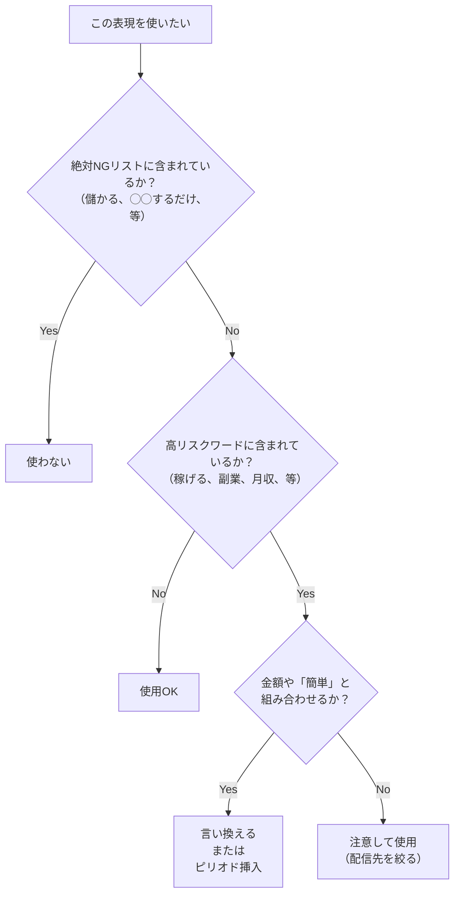
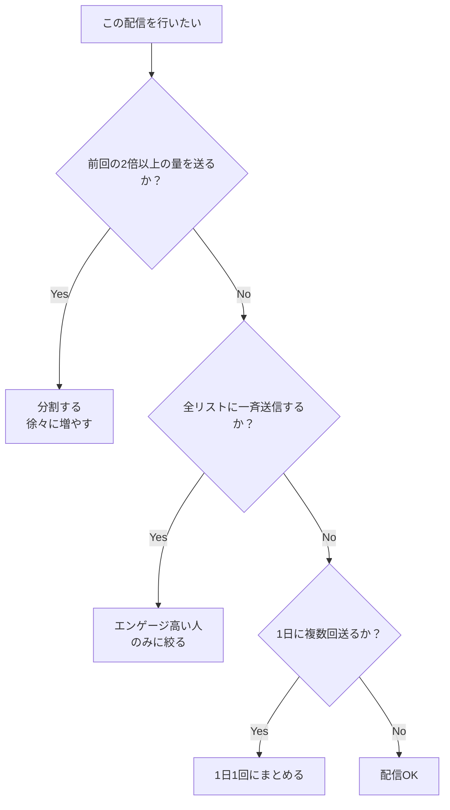
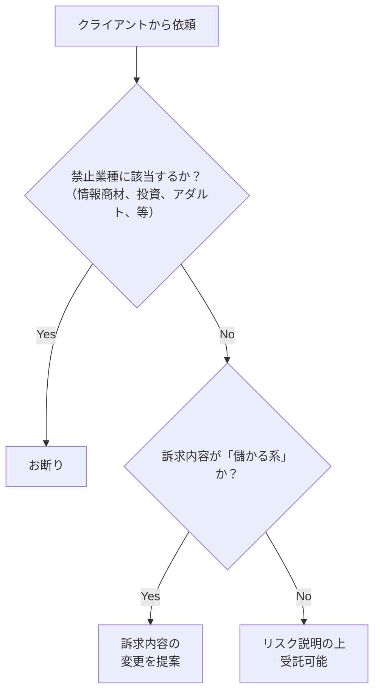

# 判断フローチャートとチェックリスト

## 8. 判断フローチャート

### 8.1 この表現は大丈夫か？

### 8.2 この配信は大丈夫か？

### 8.3 この案件は受けて大丈夫か？

---

## 9. チェックリスト

### 9.1 配信前チェックリスト
**コンテンツチェック**
- [ ] 「儲かる」「儲ける」を使っていないか
- [ ] 「◯◯するだけ」を使っていないか
- [ ] 具体的な金額（月収○万円等）を使っていないか
- [ ] 「円」という単位を使っていないか
- [ ] 「稼げる」「副業」「収入」等の高リスクワードを使っていないか
- [ ] 使っている場合、金額や「簡単」と組み合わせていないか
- [ ] 誇大表現（絶対、必ず、100%等）を使っていないか
- [ ] 煽り表現（今すぐ、誰でも簡単等）を使っていないか
- [ ] 伏せ字（●●）を使っていないか
- [ ] セールスレターに直接リンクしていないか

**配信設定チェック**
- [ ] 前回の2倍以上の量を一度に送ろうとしていないか
- [ ] 1日に複数回配信しようとしていないか
- [ ] 同じURLを短期間に連投していないか
- [ ] 全リストではなく、エンゲージの高い人に絞っているか
- [ ] 開封していない人を除外しているか

**リストチェック**
- [ ] エラーアドレスが含まれていないか
- [ ] 解除済みアドレスが含まれていないか
- [ ] オプトインを取得したアドレスのみか
- [ ] 長期間配信していないアドレスは除外したか

### 9.2 アカウント設定チェックリスト
- [ ] DKIM認証を設定しているか
- [ ] DMARC認証を設定しているか
- [ ] 配信解除リンクを挿入しているか
- [ ] 問い合わせ先の送信者名、メールアドレス、URLを記載しているか

### 9.3 BAN対策チェックリスト
- [ ] 予備のLINEアカウントを用意しているか
- [ ] BANされた際の対応フローを文書化しているか
- [ ] LINE以外の連絡手段（メール、SMS等）を確保しているか
- [ ] 用途別にアカウントを分離しているか（登録用/セミナー用/購入者用）
- [ ] 携帯番号を取得してSMSを送れる体制があるか
